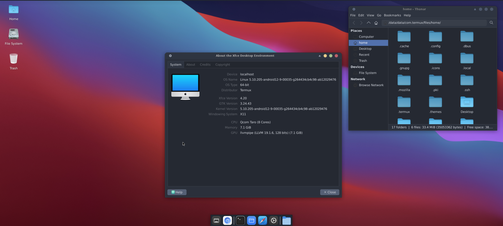

# One-click-xfce-desktop-X11

# 🖥️ One-Click XFCE Desktop X11 for Termux

### 🚀 **Easily set up and launch an XFCE desktop environment with X11 on Termux in one command!**

This script automates the installation of **XFCE desktop**, **X11 server**, **PulseAudio**, and a **macOS-inspired theme**, providing a ready-to-use desktop environment on your Android device.

---

## 📦 **Features**

- ✅ **Automated Setup:** Installs XFCE, X11 server, and PulseAudio.
- 🎨 **macOS Theme:** Applies WhiteSur GTK and icon themes.
- 🛠️ **Alias Support:** Quick launch with a single command.
- 📊 **Lightweight:** Optimized for Android's limited resources.
# Prerequisites
# **universal.apk**
- Install [Termux](https://termux.dev/) on your Android device.
- Install [Termux-X11](https://github.com/termux/termux-x11) for graphical support.
---

# **1. Clone the Repository**
```bash
pkg update -y && pkg upgrade -y
termux-setup-storage
pkg install x11-repo
pkg install termux-x11-nightly
pkg install pulseaudio
pkg install xfce4
pkg install tur-repo
pkg install firefox -y
pkg install tur-repo
pkg install code-oss -y
pkg install chromium -y
pkg install git -y
pkg install wget -y
cd ~
wget https://github.com/DeepEyeCrypto/DeepEyeCrypto/raw/refs/heads/main/DeepEyeCrypto.sh
chmod +x DeepEyeCrypto.sh
bash ~/DeepEyeCrypto.sh

```
# **1. install powerful OS**
```bash
wget https://github.com/DeepEyeCrypto/DeepEyeCrypto/raw/refs/heads/main/Powerful
chmod +x Powerful
mv Powerful $PREFIX/bin
Powerful --install
```
# **1. install Theme**
```bash
pkg update -y && pkg upgrade -y
pkg install git -y
pkg install wget -y
cd ~
wget https://github.com/DeepEyeCrypto/DeepEyeCrypto/raw/refs/heads/main/themes.sh
chmod +x themes.sh
./themes.sh

```
# **1. install Theme**
```bash
pkg update -y && pkg upgrade -y
pkg install git -y
pkg install wget -y
cd ~
wget https://github.com/DeepEyeCrypto/DeepEyeCrypto/raw/refs/heads/main/Mac-theme.sh
chmod +x Mac-theme.sh
./Mac-theme.sh

```
# **Launch XFCE Desktop
# ** START**

```bash
bash ~/DeepEyeCrypto.sh
```
---
# ** STOP **
```bash
~/DeepEyeCrypto.sh stop
```
# **2. Now install chromium **
```bash
apt update && apt upgrade -y
apt install chromium -y
```
# ** Now You Are Ready To Airdrop Hunting **

# Ubuntu Proot on Termux with X11 Support

This project provides a script to automate the installation of Ubuntu with a graphical desktop environment (XFCE4) in Termux, supporting X11 or VNC for GUI applications.

## Features
- Fully automated installation of Ubuntu (default: 22.04).
- Lightweight XFCE4 desktop environment pre-installed.
- X11 support using Termux-X11 or VNC.
- Supports arm64 architecture.

# Prerequisites
# **universal.apk**
- Install [Termux](https://termux.dev/) on your Android device.
- Install [Termux-X11](https://github.com/termux/termux-x11) for graphical support.

## Installation
1. Clone this repository or download the script directly:
   ```bash
   pkg update -y && pkg upgrade -y
   pkg install git -y
   git clone https://github.com/DeepEyeCrypto/DeepEyeCrypto.git
   cd DeepEyeCrypto
   chmod +x install-ubuntu.sh
   ./install-ubuntu.sh
   ```
   # **START**
   ```BASH
   ./start-ubuntu.sh
   
